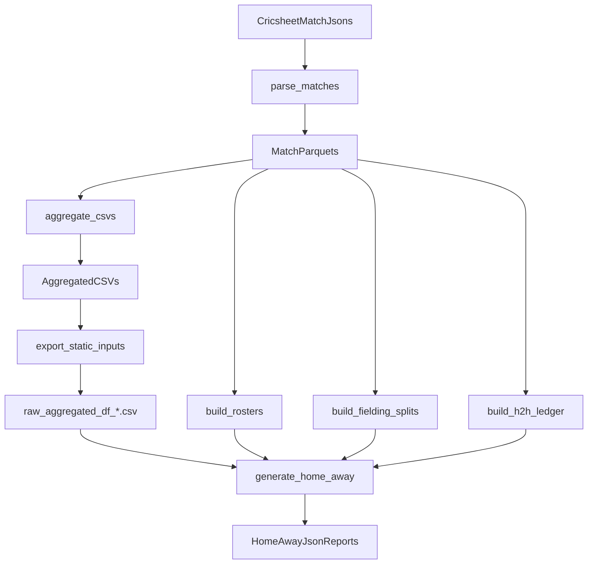

# System Design: IPL Agent + Static Reports Pipeline

## Goals

- **Primary deliverable**: deterministic generation of static matchup JSON files under `data/static_reports/home_away/` (example: `MI__PBKS__Wankhede_Stadium.json`).
- **Traceability**: every pipeline stage records its **inputs**, **outputs**, and **integrity hashes** (sha256) into a per-run `manifest.json`.
- **Local-first**: runs entirely on local filesystem; no paid/cloud services.
- **Maintainability**: modular steps, small functions, typed interfaces, explicit persistence.

---

## Repository modules (high-level)

- **Parsing (raw → processed)**: `src/utils/parser.py`
  - Reads Cricsheet IPL match JSON files and writes `data/processed/matches/<match_id>.parquet`.
- **Aggregation (processed → analytic tables)**: `src/utils/aggregator.py`
  - Reads match parquets and writes aggregate CSVs to `data/processed/aggregated/`.
- **Static report generation**:
  - H2H ledger: `src/scripts/build_h2h_ledger.py` → `data/processed/h2h_batter_bowler.parquet`
  - Fielding splits: `src/scripts/build_fielding_splits.py` → `data/processed/fielding_venue_splits.csv`, `data/processed/fielding_season_splits.csv`
  - Current rosters: `src/scripts/build_current_rosters.py` → `data/reference/current_rosters.json` (+ `.csv`)
  - Home/Away static reports: `src/scripts/generate_home_away_reports.py` → `data/static_reports/home_away/*.json` (+ `index.json`)
- **Orchestration**: `src/pipeline/orchestrator.py`
  - Runs all required stages in the correct order and persists a per-run manifest.

---

## End-to-end process flow

---

## Entry points

- **Static reports pipeline (repo root)**: `main.py`
  - Intended for batch generation of all `home_away` static JSON reports.
  - Writes a per-run manifest at `data/runs/<timestamp>_<run_id>/manifest.json`.

---

## Data persistence and traceability

### Canonical output locations

- **Match parquets**: `data/processed/matches/*.parquet`
- **Aggregate CSVs**: `data/processed/aggregated/*.csv`
- **Static-report inputs (exported bridge files)**:
  - `data/raw_aggregated_df_venue_splits.csv`
  - `data/raw_aggregated_df_season_trends.csv`
  - `data/raw_aggregated_df_career_fielding.csv`
- **Derived supporting artifacts**:
  - `data/processed/fielding_venue_splits.csv`
  - `data/processed/fielding_season_splits.csv`
  - `data/processed/h2h_batter_bowler.parquet`
  - `data/reference/current_rosters.json` (+ `.csv`)
- **Static reports**: `data/static_reports/home_away/*.json` and `data/static_reports/home_away/index.json`
  - Optional override: set `STATIC_REPORTS_DIR` to redirect report output (useful for local “write straight into the web app checkout” workflows).

### Per-run manifest

- Location: `data/runs/<timestamp>_<run_id>/manifest.json`
- Captures:
  - run configuration (resolved paths + parameters)
  - selected non-secret env vars
  - per-step timing
  - input/output file artifacts (path, sha256, size)

This manifest is the authoritative “what happened” record for reproducibility and debugging.

---

## Error handling and restart semantics

- Pipeline steps are written to be **idempotent** where reasonable.
  - Parsing and aggregation honor `--force`.
  - H2H ledger step skips rebuild if output exists and `--force` is not set.
- If a step fails, the manifest still contains completed step records up to the failure point (because it is rewritten after each step).

---

## Local quality gate

- Script: `scripts/quality_check.py`
- Runs locally (no CI requirement in this repo):
  - CodeSense check (when `CODESENSE_CMD` is configured)
  - Ruff
  - Pytest

---

## Intended purpose of major components

- `src/utils/parser.py`: ingest raw data into a stable tabular format (parquet).
- `src/utils/aggregator.py`: compute reusable aggregate tables powering tools and reports.
- `src/scripts/*.py`: single-purpose batch jobs that can run standalone or via orchestrator.
- `src/pipeline/*`: glue layer that standardizes orchestration + traceability across steps.
